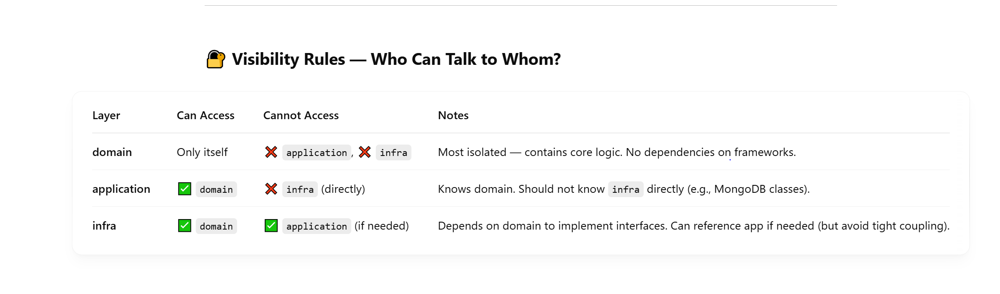

# Modular Hexagonal Architecture Project

This project demonstrates a **Hexagonal (Ports and Adapters)** architecture in a modular Maven setup.  
It separates concerns by using three main modules:

| **Layer/Module**   | **Depends On**        | **Explanation**                                                            |
|---------------------|-----------------------|----------------------------------------------------------------------------|
| **domain**         | —                     | Pure domain logic. No external dependencies.                               |
| **application**    | domain                | Application services orchestrate domain logic.                              |
| **infrastructure** | application, domain   | Contains adapters and framework code (Spring), wires up everything.        |



## Key Principles

 **Domain layer**: Pure business logic. No knowledge of frameworks like Spring.  
 **Application layer**: Orchestrates use cases and uses domain interfaces.  
 **Infrastructure layer**: Wires up frameworks (Spring, DB, APIs) and implements adapters.

## Domain module

This module contains **only pure domain logic**. It has no external dependencies and is completely agnostic to any frameworks or infrastructure concerns.

**What’s inside?**
- Domain models (Entities)
- Domain interfaces (ports)

**What’s not inside?**
- No Spring annotations
- No framework dependencies
- No infrastructure-related code

## Application module

This module defines **use cases** and orchestrates domain logic by leveraging the interfaces (ports) from the domain module.  
It **coordinates** domain interactions and ensures business rules are applied consistently.

**What’s inside?**
- Application services (e.g., `CreateProductService`, `UpdateProductService`)
- Use case orchestration

**What’s not inside?**
- No direct framework dependencies
- No infrastructure code

## Infrastructure module

This module contains **adapters** and all the framework-related code, like Spring Boot configuration, REST APIs, br.com.ricas.database access, and external integrations.

**What’s inside?**
- Spring Boot application starter
- Adapters implementing domain interfaces (e.g., br.com.ricas.database repositories)
- Configuration and integration with external systems

**What’s not inside?**
- No business logic or domain-specific rules
- No pure application logic (delegates to `application` services)

 
# Running the Application

To run the application and connect it to MongoDB Atlas, use the following commands:

### On macOS/Linux:

```bash
export MONGODB_URI="<YOUR_CONNECTION_STRING>"
cd infrastructure
mvn spring-boot:run